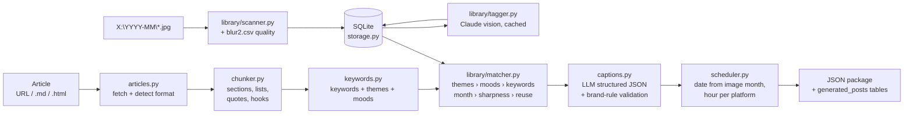

# Social Media Generator Pipeline

Turns one long-form article plus your camera roll into a batch of scheduled,
platform-specific social posts, packaged as JSON and tracked in SQLite.

It is built around the setup you already have:

| You have | The pipeline uses it as |
|---|---|
| Articles on your website (HTML) or drafts in Markdown | The content source (`run --url` or `run --file`) |
| Camera roll on Google Drive at `X:\`, filed into `YYYY-MM` folders by `Sort-CameraRoll.ps1` | The image library. Month comes from the folder name. |
| `photo-organizer\records\blur2.csv` (blur, contrast, brightness, dimensions per photo) | A quality pre-filter, so only sharp photos are considered and only those are sent for tagging |
| `X:\blurred` review folder | Skipped entirely |
| Unlabelled photos | Claude's vision input tags them once (subject, themes, moods, keywords, alt text); tags are cached in SQLite |

Videos, `.insv`/`.insp` 360 files, and the Insta360 backup folder are ignored in this version (see
[Beyond this pipeline](#beyond-this-pipeline-what-to-connect) for how to bring them in).

## Architecture



Stages are independent modules with one dataclass boundary each (`models.py`), so any of them can be
swapped: a different chunker, a different tagger, a different LLM provider, a different scheduler.

| Module | Responsibility | Failure handling |
|---|---|---|
| `articles.py` | Load from URL, file or text; detect HTML vs Markdown; extract title | `ArticleLoadError` (retryable on 5xx/429/network) |
| `chunker.py` | Boilerplate stripping, heading-aware packing into 150–700 char chunks, list and quote chunks, "hook" sentences with context, `post_score` ranking | `ChunkingError` when nothing usable |
| `keywords.py` | RAKE-style keywords; lexicon mapping to the shared `THEMES` / `MOODS` vocabularies | Pure functions, never raise |
| `library/scanner.py` | Walk `YYYY-MM` folders, join `blur2.csv` by `month/filename`, read dimensions when no record | `ImageIndexError` if the drive is not mounted |
| `library/quality.py` | Score new photos with the same columns as `blur2.csv` (perceptual blur, Laplacian variance, p99, contrast) and append them | Per-photo failures reported; CSV backed up before append |
| `library/tagger.py` | Downscale to 1024 px JPEG, Claude vision call with a JSON-schema-constrained response, candidate selection (sharp + right month first) | Per-photo errors are logged and skipped; retry on rate limits |
| `library/matcher.py` | Weighted scoring, in-run de-duplication, fallback to the sharpest untagged photo | `NoImageMatchError` only when the library is empty |
| `llm/` | `anthropic_provider.py`, `openai_provider.py`, `mock_provider.py` behind one `complete_json()` interface | Typed SDK errors mapped to retryable / non-retryable |
| `captions.py` | Prompt assembly (cached system prompt), platform + brand rule validation, one corrective round, then mechanical auto-fix | Warnings recorded on the post, never silent |
| `scheduler.py` | Posting window from the image's month, even spread across weekdays, per-platform hour in your timezone | `ValueError` on a bad timezone |
| `storage.py` + `schema.sql` | SQLite repository; idempotent upserts | `StorageError` |
| `pipeline.py` | Orchestrates a run; one chunk failing never stops the others | Run status `succeeded` / `partial` / `failed` |
| `cli.py` | `init-db`, `status`, `scan`, `score`, `tag`, `run`, `leaplog`, `posts`, `set-status`, `serve` |
| `sources/leaplog.py` | Leap Log listing in site order, Portable Text → Markdown, page fetch for hardcoded posts | `ArticleLoadError` (site route falls back to the Sanity CDN) |
| `api.py` + `jobs.py` + `ui/index.html` | Local FastAPI service and the review page; long operations run as background jobs | Job errors surface in the UI; validation errors return 400 | Exit code 0 / 2 (partial) / 1 |

### How matching works with unlabelled photos

1. `scan` indexes every `.jpg/.jpeg/.png/.webp/.gif/.heic` under `X:\YYYY-MM\` with its blur score.
2. `tag` (or `run`, which tags on demand) sends the sharpest untagged photos, target month first, to
   Claude with the photo downscaled to 1024 px. The response is constrained to a JSON schema whose
   `themes` and `moods` are enums drawn from `models.THEMES` / `models.MOODS`.
3. The chunk analyser maps article text onto the same enums with a lexicon. Matching is then mostly
   a controlled-vocabulary overlap (robust) with free-text keyword overlap as a tie-breaker.
4. Score = 3.0 per shared theme (+1 if the dominant theme agrees) + 1.0 per shared mood
   + up to 3.0 for keyword hits + 2.0 same month / 0.5 adjacent / −1.0 otherwise − 2.0 × blur
   − 1.0 per previous use − 0.5 if the photo has readable text. Weights live in `MatchWeights`.

## Setup (Windows, Google Drive for Desktop)

Requirements: Python 3.10+, Google Drive for Desktop running (so `X:\` is reachable), an Anthropic API key
or `ant auth login`.

```powershell
cd C:\path\to\ai-ij\03-ai-implementations\social-media-generator
python -m venv .venv
.\.venv\Scripts\Activate.ps1
pip install -e ".[dev]"
# optional extras
pip install pillow-heif      # iPhone .heic photos
pip install openai           # if you want LLM_PROVIDER=openai for captions

copy .env.example .env
notepad .env                 # set ANTHROPIC_API_KEY, IMAGE_ROOT=X:\, RECORDS_DIR=...\photo-organizer\records
```

`.env.example` is pre-filled for your layout, including `BRAND_VOICE_FILE=brand/qylat.md`, which carries the
QYLAT voice rules into the caption prompt (no em dashes, no hashtags, no money figures, story first).

## Running it

```powershell
social-pipeline init-db                       # creates social_pipeline.db
social-pipeline scan                          # index X:\YYYY-MM photos + blur scores (fast, no API)
social-pipeline scan --months 2026-09,2026-08 # or just the months you care about

social-pipeline tag --month 2026-09 --list    # see which photos would be tagged, no API calls
social-pipeline tag --month 2026-09 --limit 40  # tag them (about 1–2¢ per photo on claude-opus-5)

social-pipeline run --url https://quityourlifeandtravel.com/some-article --month 2026-09
social-pipeline run --file examples\sample-article.md --platforms facebook,instagram --max-posts 4
social-pipeline run --file article.md --dry-run   # full pipeline with mock LLM + mock tagger, zero cost

social-pipeline posts                         # what has been generated, by date
social-pipeline set-status <post_id> approved
social-pipeline status
```

### Scoring photos that arrived after your last blur run

`blur2.csv` only knows the photos that existed when your organiser scored them. Anything newer has no
row, so the pipeline can't filter it on sharpness. The `score` command fills the gap with the same
columns (`blur` is the Crete-Roffet perceptual metric, verified against scikit-image's `blur_effect`
to within 0.3%, so the 0.42 cut-off still applies):

```powershell
social-pipeline score --dry-run          # list photos with no quality record
social-pipeline score                    # score them, append to blur2.csv (backup: blur2.csv.bak), re-scan
social-pipeline score --months 2026-09   # just one month
social-pipeline score --verify 10        # re-score 10 already-scored photos and compare with the CSV
```

**The "button"**: `scripts\Score-NewPhotos.cmd` does `score` + `status` and waits for a keypress.
Double-click it, or pin a shortcut to it. To make it automatic, add a second action to your existing
*Camera Roll Month Filer* scheduled task that runs the `.cmd` after `Sort-CameraRoll.ps1`.

`run` will scan the library automatically if the image table is empty, and tags up to `TAG_MAX_PER_RUN`
new photos before matching. Use `--no-auto-tag` to only use photos already tagged.

Exit codes: `0` all posts generated, `2` some chunks failed (see `errors` in the JSON), `1` nothing generated.

### Scheduling the whole thing

Same pattern as your existing scheduled tasks. Example wrapper for Task Scheduler:

```powershell
# Run-SocialPipeline.ps1
$env:Path = "C:\path\to\.venv\Scripts;" + $env:Path
Set-Location C:\path\to\social-media-generator
social-pipeline scan --months (Get-Date -Format 'yyyy-MM') | Out-Null
social-pipeline run --url $args[0] --out ("output\" + (Get-Date -Format 'yyyyMMdd-HHmm') + ".json")
```

## The Leap Log as the article source

The review page opens with **The Leap Log** listed exactly as your site orders it (pinned post first,
then newest), read from the site's own `/api/posts` route with the Sanity CDN as a fallback, plus the
hardcoded post from `data/posts.tsx`. Each row shows what has been generated and approved; the first
row with nothing generated is marked **next up**. Click **Generate posts** on a row (or run it from the
terminal) and the article is fetched the clean way: Sanity posts come in as Markdown converted from
Portable Text (no page chrome), the hardcoded post is fetched as HTML with the site's `not-prose`
widgets (email form, CTAs) stripped.

```powershell
social-pipeline leaplog                                           # list posts in site order
social-pipeline run --slug how-to-move-to-thailand-in-60-days     # the pinned first article
```

Settings: `SITE_BASE_URL`, `SANITY_PROJECT_ID`, `SANITY_DATASET`, `LEAPLOG_PINNED_SLUG`,
`LEAPLOG_EXTRA_SLUGS` (comma-separated slugs that exist only in `data/posts.tsx`). Re-running a slug
updates the same article in place because its identity is the canonical `/leap/<slug>` URL.

## Review UI and API

```powershell
social-pipeline serve            # http://127.0.0.1:8765/  (API docs at /api/docs)
```

The page runs on your PC so it can show the photos straight from `X:\`. For each post you see the
photo, its tags and match reasons, the source excerpt, and one tab per platform with an editable
caption, hashtags, live character/word counts against the platform limit, and the four unused hooks
(click one to swap it in as the first line). Buttons: **Save edits**, **Approve**, **Reject**,
**Back to draft**; the date picker moves the post (all platform times follow). The library panel has
**Scan**, **Score new photos** and **Tag photos**; **Run an article** takes a URL or pasted text, with a
dry-run switch. **Export approved JSON** downloads approved posts with absolute image paths for a
publisher (Buffer, Publer, n8n, your own script).

Endpoints (all JSON; long operations return `202` with a job you poll):

| Method & path | What it does |
|---|---|
| `GET /api/status` | Config, library counts, post counts by status, current job |
| `GET /api/leaplog` | Site's post list in site order with generated/approved counts and `next_up` |
| `GET /api/posts?status=&article=` · `GET /api/posts/{id}` | Posts with photo, chunk, tags and per-platform variants |
| `PATCH /api/posts/{id}` | `{status, suggested_post_date, notes, image_alt_text}` |
| `PUT /api/posts/{id}/variants/{platform}` | `{body, hashtags}`; rejects text over the platform limit |
| `GET /api/export?status=approved` | Publishing-ready shape: text per platform, absolute image path, times |
| `GET /api/images/{id}/thumb?w=640` · `GET /api/images/{id}/file` | Cached thumbnail / original |
| `POST /api/library/scan` · `/score` · `/tag` | Background jobs (`{months}` / `{month, limit}`) |
| `POST /api/runs` | `{slug \| url \| text \| path, title, month, max_posts, platforms, auto_tag, dry_run}` |
| `GET /api/jobs/{id}` · `GET /api/jobs` | Job status, result and captured log lines |

One job runs at a time (a second request gets `409`). The server binds to `127.0.0.1` and has no
authentication; keep it that way unless you put it behind something that does.

## Output JSON

One file per run under `OUTPUT_DIR` (or `--out`). Trimmed example:

```json
{
  "run_id": "b2f1…", "status": "succeeded",
  "article": {"id": "4859…", "title": "90 days in Chiang Mai", "source_url": "https://…"},
  "stats": {"chunks_total": 9, "chunks_selected": 4, "posts_generated": 4,
            "images_tagged_this_run": 12, "llm_usage": {"input_tokens": 18422, "output_tokens": 3120, "cache_read_input_tokens": 9600}},
  "posts": [
    {
      "post_id": "cae6…",
      "theme": "the licence",
      "chunk": {"index": 0, "kind": "section", "heading": "Arriving without a licence", "text": "…",
                "keywords": ["motorcycle licence", "…"], "themes": ["transport_road"], "moods": ["reflective"]},
      "image": {"path": "2026-09/IMG_20260905_162045.jpg", "month": 9, "year": 2026, "orientation": "landscape",
                "subject": "red scooter parked on a quiet street", "themes": ["transport_road", "city_streets"],
                "match_score": 7.4, "match_reasons": ["same month", "themes: transport_road", "keywords: scooter"], "is_fallback": false},
      "image_alt_text": "A red scooter parked beside a quiet Chiang Mai street in morning light",
      "suggested_post_date": "2026-09-16",
      "platforms": {
        "facebook":  {"body": "I arrived without a driving licence. …", "hashtags": [], "full_text": "…", "char_count": 612,
                      "word_count": 108, "suggested_post_at": "2026-09-16T19:00:00+07:00", "alternate_hooks": ["…", "…", "…", "…"]},
        "instagram": {"…": "…", "suggested_post_at": "2026-09-16T18:00:00+07:00"},
        "linkedin":  {"…": "…", "suggested_post_at": "2026-09-16T08:00:00+07:00"},
        "x":         {"…": "…", "char_count": 241, "suggested_post_at": "2026-09-16T12:00:00+07:00"}
      },
      "generation": {"provider": "anthropic", "model": "claude-opus-5"}
    }
  ],
  "warnings": ["chunk 3: x: trimmed hashtags to 2"],
  "errors": []
}
```

`image.path` is relative to `IMAGE_ROOT`, so `X:\` + path is the file to upload.

## Database schema

`social_pipeline/schema.sql` (SQLite, applied automatically). Portable to Postgres by swapping
`TEXT` timestamps for `TIMESTAMPTZ` and `AUTOINCREMENT` for `SERIAL`.

| Table | Purpose | Key columns |
|---|---|---|
| `articles` | One row per article; id = hash of URL (or content) so re-runs update in place | `title`, `source_url`, `source_format`, `raw_content`, `content_hash` |
| `article_chunks` | Chunker output + analysis | `kind`, `heading`, `body`, `context`, `keywords_json`, `themes_json`, `moods_json`, `post_score` |
| `images` | Every photo: technical attributes from the folder + `blur2.csv`, semantic tags from the vision model (NULL until tagged) | `path`, `month`, `year`, `width`, `height`, `blur`, `contrast`, `brightness`, `subject`, `themes_json`, `moods_json`, `keywords_json`, `alt_text`, `suitable_for_social`, `tagged_at`, `used_count`, `missing` |
| `image_tags` | Normalised tags for plain SQL search (`SELECT … WHERE tag = 'scooter'`) | `image_id`, `tag`, `tag_type` |
| `pipeline_runs` | Audit + cost per run | `status`, `provider`, `model`, `stats_json` |
| `generated_posts` | One chunk × one image × one date, with a workflow `status` | `chunk_id`, `image_id`, `match_score`, `suggested_post_date`, `status` (draft → approved → scheduled → published / rejected), `reviewed_at`, `notes` |
| `post_variants` | The per-platform text | `platform`, `body`, `hashtags_json`, `alternate_hooks_json`, `char_count`, `suggested_post_at`, `edited_at`, `published_url` |

Useful queries:

```sql
-- what is scheduled next week
SELECT p.suggested_post_date, v.platform, substr(v.body, 1, 80), i.path
FROM generated_posts p JOIN post_variants v ON v.post_id = p.id JOIN images i ON i.id = p.image_id
WHERE p.status = 'approved' AND p.suggested_post_date BETWEEN date('now') AND date('now', '+7 days');

-- untagged sharp photos per month (what `tag` would spend money on)
SELECT year, month, COUNT(*) FROM images WHERE tagged_at IS NULL AND blur <= 0.42 AND missing = 0 GROUP BY 1, 2;
```

## Costs and safety rails

- Tagging sends each photo once, downscaled to 1024 px (about 1,000–1,500 input tokens). With
  `claude-opus-5` that is roughly one to two cents per photo; `TAG_MAX_PER_RUN` caps it.
  Set `LLM_MODEL=claude-sonnet-5` in `.env` if you want cheaper tagging and captions.
- Captions: one call per chunk for all platforms at once; the system prompt is cache-controlled, so
  the second chunk onward reads the brand rules from cache.
- `ANTHROPIC_SERVER_FALLBACKS=true` (default) re-runs a request the model declines on a fallback
  model inside the same call; set it to `false` to turn that off.
- `--dry-run` exercises everything with mock providers. `tag --list` previews spend before tagging.
- Only `.env` holds secrets; the SDK also honours `ant auth login`, in which case leave the key unset.

## Beyond this pipeline: what to connect

Things Claude does here: reading the article, chunking, seeing the photos, writing the posts,
picking dates. Things Claude should not be the tool for, with what to use instead:

| Need | Recommendation | Why |
|---|---|---|
| **Actually publishing / scheduling** to Facebook, Instagram, LinkedIn, X | **Buffer** or **Publer** (both have APIs and per-platform previews), **Metricool** if you also want analytics; or an **n8n** / Make / Zapier workflow that reads the JSON and calls each platform's node | The pipeline stops at "approved draft" on purpose; platform APIs change often and Meta requires an app review that a scheduler already holds |
| **Instagram via the Graph API** (if you script it yourself) | Host the chosen photo on **Cloudinary** (free tier) or S3 and pass the public URL | Instagram's API only accepts a public image URL, and a Google Drive share link does not work |
| **Resizing / cropping** to 4:5 or 9:16 per platform | Cloudinary transformations, or Pillow locally (already installed) | Vision tagging already records orientation, so you can pick a crop rule per platform |
| **iPhone `.heic`** | `pip install pillow-heif` | The API accepts JPEG/PNG/WebP/GIF only; the tagger converts on the fly once the codec is present |
| **Insta360 `.insp` / `.insv`** | Export flat JPG/MP4 from **Insta360 Studio** into the month folder | 360 formats are not readable by any vision API |
| **Videos and Reels** | `ffmpeg` to extract the sharpest frame (your `videos.csv` already knows `blur_sharpest`), then tag that frame like a photo | Claude can't watch video; a representative frame is enough to match a chunk |
| **Semantic search across tens of thousands of photos**, duplicates, faces | **Immich** or **PhotoPrism** (self-hosted, free, CLIP-based) or **Excire Foto**; cloud: Google Cloud Vision, AWS Rekognition, Azure AI Vision | Per-photo LLM tagging is the right tool for hundreds of candidates a month, not for a full back-catalogue index |
| **Discovering new articles automatically** | Your site's RSS feed or the WordPress REST API in a scheduled task that calls `run --url` | Cheaper and more reliable than crawling |
| **Post performance** | Metricool, or Supermetrics if you want it in a spreadsheet | Feed the winners' hooks back into `brand/qylat.md` |

## Extending

- **New platform**: add a `PlatformSpec` to `platforms.py` and the name to the `CHECK` in `schema.sql`.
- **New LLM provider**: implement `complete_json(JSONRequest) -> LLMResult` (see `llm/mock_provider.py`)
  and register it in `llm/__init__.py`. Vision tagging currently has an Anthropic and a mock implementation;
  a provider without one falls back to untagged photos.
- **Different matching weights**: pass `MatchWeights(...)` to `ImageMatcher`.
- **Different chunk sizes / more hooks**: `CHUNK_MIN_CHARS`, `CHUNK_MAX_CHARS`, `HOOK_CHUNKS`.

## Tests

```powershell
python -m pytest -q
```

47 tests cover chunking, quality scoring, the Leap Log source, the HTTP API and review flow (HTML and Markdown), keyword/theme extraction, quality-record joins,
candidate selection, matching, caption validation and auto-fix, retries, scheduling, storage, and the
full pipeline with mock providers. No network access is needed.
